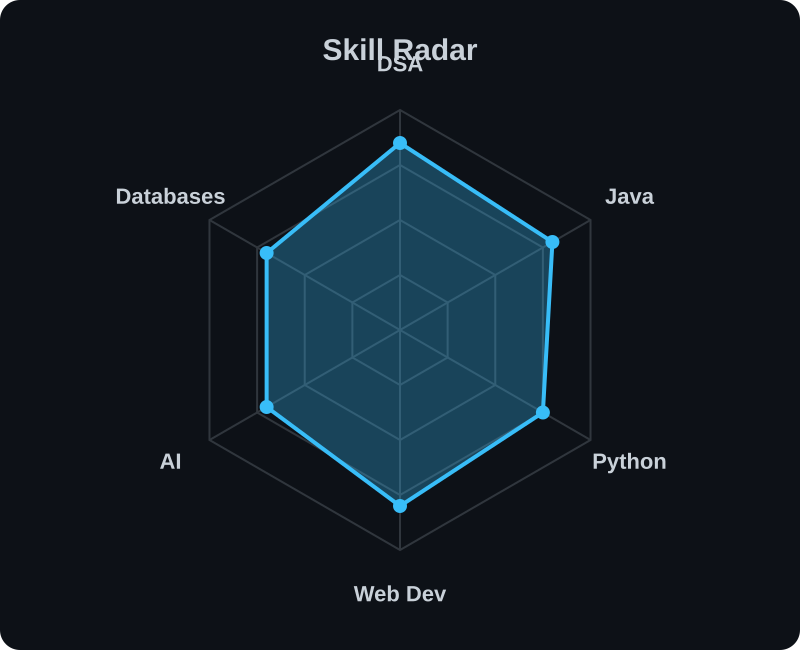
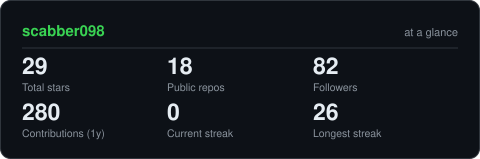

<div align="center">

<a href="https://github.com/scabber098">
  
</a>

<br>

<a href="https://www.linkedin.com/in/kunwardeep-singh-dev">
  
</a>

<a href="mailto:kunwardeepsingh797@gmail.com">
  
</a>

<a href="https://leetcode.com/u/kunwar_7/">
  
</a>

<br><br>


</div>

---

## `~/` whoami

```console
$ cat about.txt
```

Hi, I'm **Kunwardeep Singh**, a **Computer Science Engineering student** passionate about programming, problem solving, web development, and building useful projects.

- Currently improving my **Data Structures & Algorithms** skills
- Interested in **Web Development and Software Development**
- Regularly solving problems on **LeetCode**
- Learning new technologies and building projects
- LinkedIn: **[kunwardeep-singh-dev](https://www.linkedin.com/in/kunwardeep-singh-dev)**
- Email: **[kunwardeepsingh797@gmail.com](mailto:kunwardeepsingh797@gmail.com)**
- Fun fact: **I enjoy solving challenging problems and turning ideas into working projects.**

---

<div align="center">

## `~/` toolbox


</div>

---

<div align="center">

## `~/` skill radar

<table>
<tr>

<td width="50%" align="center" valign="middle">

<h3>Skills</h3>

<picture>
  <source media="(prefers-color-scheme: dark)" srcset="assets/radar-dark.svg">
  <source media="(prefers-color-scheme: light)" srcset="assets/radar-light.svg">

  
</picture>

</td>

<td width="50%" align="center" valign="middle">

<h3>Languages</h3>

<picture>
  <source media="(prefers-color-scheme: dark)" srcset="assets/radar-langs-dark.svg">
  <source media="(prefers-color-scheme: light)" srcset="assets/radar-langs-light.svg">

  
</picture>

</td>

</tr>
</table>

</div>

---

<div align="center">

## `~/` contribution calendar


<br><br>

<picture>
  <source media="(prefers-color-scheme: dark)" srcset="https://raw.githubusercontent.com/scabber098/scabber098/output/snake-dark.svg">

  <source media="(prefers-color-scheme: light)" srcset="https://raw.githubusercontent.com/scabber098/scabber098/output/snake.svg">

  
</picture>

</div>

---

<div align="center">

## `~/` the numbers

<picture>
  <source media="(prefers-color-scheme: dark)" srcset="assets/card-stats-dark.svg">

  <source media="(prefers-color-scheme: light)" srcset="assets/card-stats-light.svg">

  
</picture>

<br>


<br><br>


</div>

---

<div align="center">

## `~/` coding profiles

<a href="https://leetcode.com/u/kunwar_7/">
  
</a>

<a href="https://www.linkedin.com/in/kunwardeep-singh-dev">
  
</a>

<a href="mailto:kunwardeepsingh797@gmail.com">
  
</a>

</div>

---

<div align="center">

### Thanks for visiting! 👨‍💻

<sub>Always learning. Always building. Always improving.</sub>

</div>
